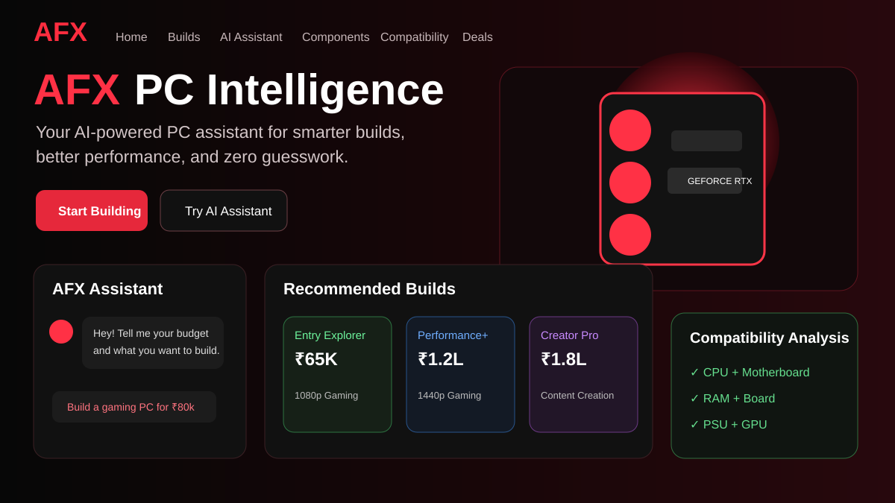

<p align="center">
  
</p>

# AFX PC Intelligence

An interactive PC assistant created by Shaik Arfan for a college hackathon.

AFX is an original, assistant-led 3D PC experience created by Shaik Arfan. It uses a cinematic black and red interface, a layered Arfan character, and an interactive CSS 3D tower model. The visual direction takes inspiration from immersive portfolio motion while keeping AFX's own layout, character, and PC tools.

AFX helps visitors explore PC designs, generate a compatible tower build from an Indian-rupee budget, analyse a current PC, check compatibility, compare builds, estimate illustrative game performance, and find a targeted upgrade. Saved builds stay in this browser and can be reopened, deleted, or exported as JSON.

## Demo flow

1. Enter AFX and meet Arfan.
2. Ask “Show me PC designs” or select a collection build.
3. Say or type “Build me a gaming PC for eighty thousand”.
4. Load the demo PC and run the analyzer.
5. Review compatibility, upgrade suggestions, comparison scores, and FPS estimates.

## Features

- Cinematic black and red interface with responsive 3D depth, lighting, perspective cards and reduced-motion support.
- Transparent PNG assistant character with idle, pointer and speech motion, plus an animated multi-face CSS 3D PC tower.
- Browser Speech Synthesis fallback with captions, mute control and optional `public/audio/` recordings.
- Optional `SpeechRecognition` voice commands; all functionality remains available through typed commands.
- Local Indian-rupee budget parsing for numbers, “80k”, “eighty thousand”, “one lakh” and related phrases.
- Deterministic compatibility, build, upgrade, score and performance engines, covered by automated tests.
- Local saved builds with reopen, remove and JSON export actions.
- Product search across 13 hardware categories, store/budget filters, sorting and live-result pagination.
- 16 sourced, higher-resolution product photos with click-to-enlarge: 12 laptops plus SSD, RAM, monitor and mouse listings.
- Photos, prices and Amazon/Flipkart links inside chat, with shopping follow-ups and clearer troubleshooting replies.
- Optional server-side live search using SerpAPI, plus optional OpenAI chat; both fail visibly into the built-in guide and saved catalogue.
- Browser-only device hints with privacy limitations explained.
- Mobile-first responsive layout, keyboard focus states, reduced-motion support and touch-friendly design carousel.
- Optional WebMCP `configure_pc_build` action when the browser exposes `document.modelContext`.
- Netlify-ready redirects and configuration.

## Preview without installing anything

Open **AFX-Preview.html** in Chrome or Edge, then press **ENTER AFX**. This single file includes the app, fonts, character image and all saved product photos. It does not need a server or npm.

Type **Hi Arfan**, **What does RAM do?**, or **Build a gaming PC for 80k**. Chat keeps a visible history, replies to your messages and offers buttons to open the relevant tools. The offline preview uses the built-in PC guide. When browser storage is unavailable, saved builds last for the current session; JSON export keeps a copy.

Run **npm run build:preview** to regenerate the standalone preview after editing.

## Search PCs, laptops and accessories

Choose **PRODUCT SEARCH** in the menu or the home-page shortcut. Search a model or phrase such as **1TB SSD**, **gaming laptop under 80k**, **RTX graphics card**, or **mechanical keyboard**. Categories cover laptops, desktops, GPUs, CPUs, RAM, storage, motherboards, monitors, peripherals, audio, cooling/cases, power and accessories. Direct Amazon India and Flipkart searches work for any query.

Without a server connection, the app searches 16 saved listings (14 appear by default because two laptop listings were marked out of stock). Empty categories offer direct store searches. It never fills missing products with invented prices or unrelated stock photos.

To enable live results, deploy the source with its Netlify functions and set **SERPAPI_API_KEY** in the server environment. **Amazon India** results come from the Amazon search engine; **Flipkart** results are Google-indexed product pages. Photos appear when the provider returns them. Missing prices show **Check store**; budget filters exclude unknown prices. Live results can be paginated, and individual-store failures are visible. This is search coverage, not every product in either retailer's inventory.

The server caches successful queries for five minutes; upstream results can also be cached. It validates retailer links and image hosts, and never returns API keys or raw provider errors. Provider access and quotas are managed in your provider account. No live key is included. The static ZIP and standalone HTML have no backend; they use the guide and saved listings. See **DEPLOY.md** for the source deployment steps and **PRODUCT-SOURCES.md** for data provenance.

## Arfan's hardware help

Chat now distinguishes shopping from questions about overheating, slow PCs, charging, batteries, RAM/SSD upgrades, Wi-Fi, black screens and crashes. Search replies contain product photos, dated prices and retailer buttons. Follow-up budgets and store preferences carry through the conversation. Live AI handles broader PC and laptop questions when configured; the built-in guide explicitly says when it cannot answer reliably.

## Laptop catalogue

Choose **LAPTOPS** in the menu, open the detailed collection from Product Search, or ask Arfan **gaming laptops under 80k**. The 12-listing collection includes seven brands. Search, filter, sort and open retailer links. Listings marked out of stock are labelled and can be hidden.

The included INR prices are retailer listing snapshots collected on **25 September 2026**, not a live price feed. Cached prices are labelled. Bank offers and extra fees are excluded; confirm the full model code, price and availability on the retailer page. Amazon links are exact-model searches, with no unverified Amazon price or stock claims. Use the full-store searches for other models. This is not every laptop sold by either store: exhaustive coverage needs an authorised retailer catalogue feed.

Product photos are bundled locally, and the standalone preview embeds them. See **LAPTOP-SOURCES.md** for image and listing sources. Edit **src/data/laptops.js** to maintain the collection.

## Connect live AI chat

The package includes **netlify/functions/chat.mjs**. On a source deployment to Netlify, set **OPENAI_API_KEY** in the server environment, optionally set **OPENAI_MODEL** (default: gpt-5-mini), then redeploy. The key is used only by the server function. Do not put it in a browser setting or a VITE_ environment variable.

The chat label changes to **AI connected** when the server returns a model reply. Without a key, or if the connection fails, messages get a visible built-in PC guide reply and a connection notice. The standalone preview always uses the guide.

The integration uses OpenAI's [Responses API](https://developers.openai.com/api/docs/guides/text). The model is configurable on the server.

Deploy the source folder to use the function; uploading only dist/ as a static site does not deploy a backend. For local function development, use Netlify's development environment. Live API calls have not been tested with a real key; the request, response parsing and failure paths have automated tests.

## Run the source locally

```bash
npm ci
npm run dev
```

Open the local address printed by Vite. Production validation:

```bash
npm test
npm run build
```

For a quick preview of the included production build, run `npm run preview` after `npm ci` and open `http://localhost:4173`.

## Deploy to Netlify

For a manual static deployment, extract **AFX-PC-Intelligence-Netlify.zip** and upload the folder containing **index.html**. Use the prebuilt ZIP for this quick-upload route. The static version supports the built-in chat guide and store links.

For live AI chat and retailer search, push this source folder to a Git repository and connect that repository to Netlify. The included `netlify.toml` runs `npm run build` and publishes `dist`. The `public/_redirects` file keeps React routes working after refresh.

## Voice notes

The first voice line is spoken only after the user presses **ENTER AFX**, which satisfies browser audio policies. Installed browser voices vary by device; the app prefers English voices with an `en-IN`, `en-GB` or `en-US` language, then shows the spoken line as a caption. Browser voice metadata does not reliably expose gender. Add a consenting male recording as `public/audio/intro.mp3`, `designs.mp3` or `budget.mp3` for consistent playback.

Speech recognition support depends on the browser and may use its configured recognition provider. The microphone is optional and typed commands work without permission.

## Scope and methodology

Component prices are curated illustrative Indian planning values, not live retailer quotes. Compatibility is checked against the catalogue fields included in `src/data/hardware.js`. Scores and FPS are deterministic teaching models, not benchmark results. Read `public/METHODOLOGY.md` before using the estimates for a purchase decision.

## Future roadmap

- Add authorised retailer catalogue feeds for fuller inventory coverage.
- Add exact manufacturer-model compatibility data and BIOS support checks.
- Add a real benchmark dataset with test hardware, driver versions and settings.
- Add optional recorded narration and a server-backed account for saved builds.
